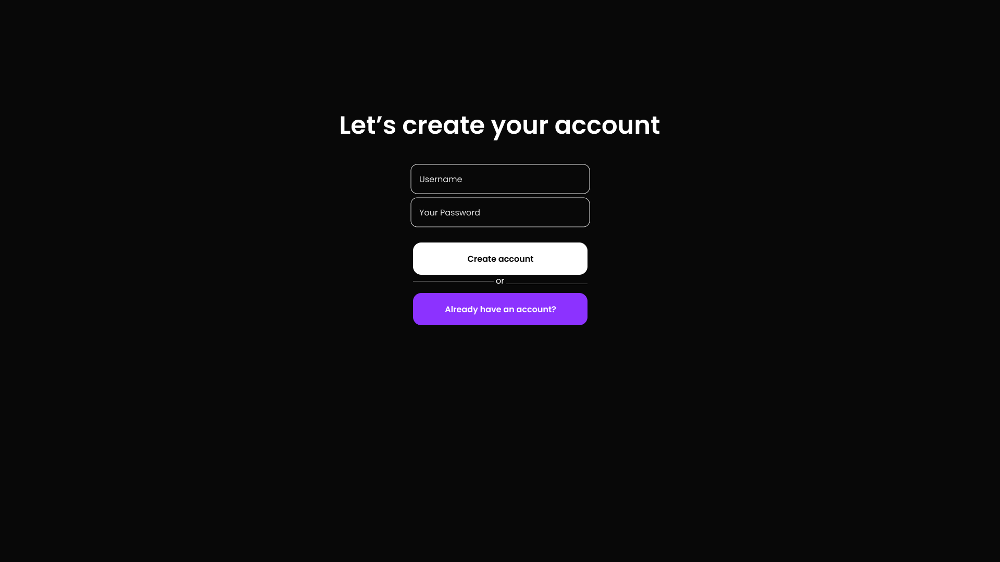
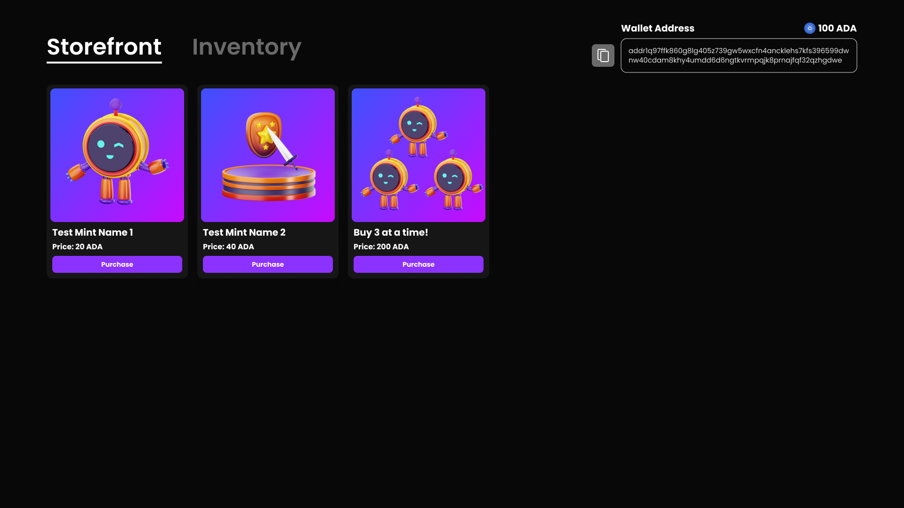
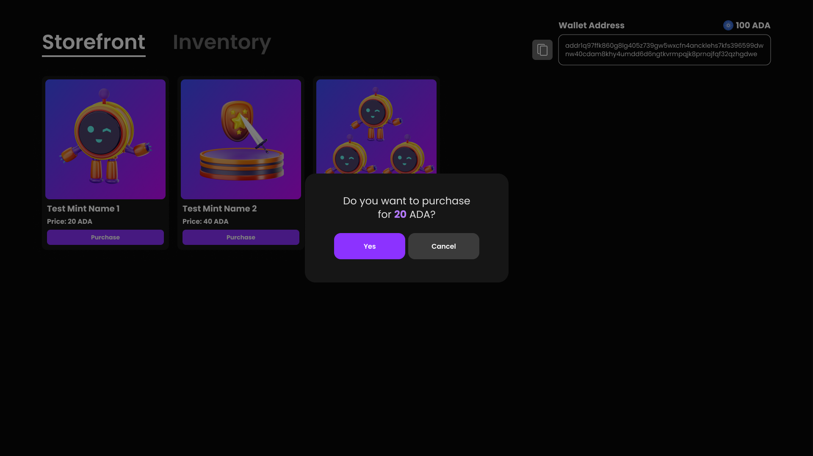
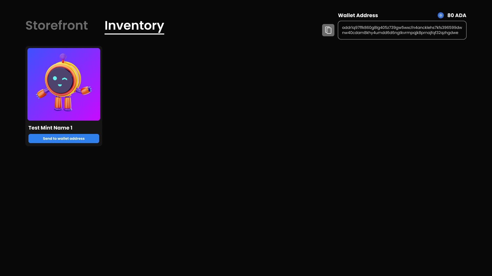
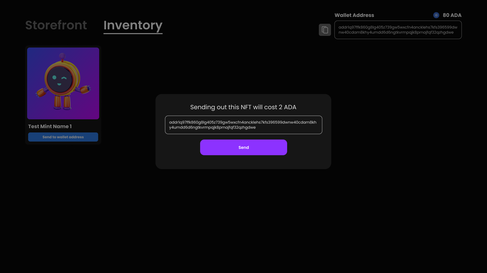

# NMKR-Studio-Unity-SDK
A Unity wrapper for NMKR Studio API


# **Introduction**

The NMKR Studio Unity SDK is a software development kit designed to facilitate the integration of NMKR services into Unity-based applications. This SDK primarily focuses on Managed Wallet functionality and Minting of NFTs. This document provides a comprehensive guide for developers looking to integrate this SDK into their Unity projects.

---

## **Getting Started**

### **Prerequisites**

Ensure that you have the following prerequisites in place:

- Unity Project (tested on version 2022.3)
- An NMKR Studio account
    - Preprod for testing (https://studio.preprod.nmkr.io/)
    - Mainnet for production (https://studio.nmkr.io/)
- Basic knowledge of Unity development

### **Installation**

To integrate the NMKR Studio Unity SDK into your Unity project, follow these steps:

1. Copy package URL from GitHub
    1. Go to https://github.com/FutureFest/NMKR-Studio-Unity-SDK > Code > Local > HTTPS > Copy git URL
    2. or copy this: https://github.com/FutureFest/NMKR-Studio-Unity-SDK.git
    
2. Import package into Unity project
    1. Go to your Unity project’s Package Manager
    2. Click ‘+’ button at top left corner of Package Manger window
    3. Click “Add package from git URL…” 
    4. Paste the git URL and click “Add”
    5. Package should be under Packages folder in Project view
3. Package should be installed and ready to use!


### Example Initialize

Here's an example of how you would initialize the SDK for Preprod:

```csharp
using UnityEngine;
using Nmkr.Sdk;
using Nmkr.Sdk.Schemas;
using static Nmkr.Sdk.Api;

public class ExampleUsage : MonoBehaviour
{
    [SerializeField] private string customerId = "000000"; //user id of NMKR Studio account
    [SerializeField] private string apiKey = "abc...123"; // api keys are created from NMKR Studio website
    [Space]
    [SerializeField] private string projectUid = "123...abc";

    private void Awake()
    {
        ApiSettings settings = new ApiSettings()
        {
            apiServer = ApiServer.Preprod,
            apiKey = apiKey
        };

	// After initialization, the NMKR Studio API can now be used
        Initialize(settings);
    }
}
```
---
## Tasklist


---

## Demo Prototype

Below is a prototype of the designs for the demo we are creating.

- General Account Creation/Sign in
    - Account name and password will match the created managed wallet name and password
    - All sensitive information will be embedded in the demo (not to be used in production)
- Storefront (View of NFTs on sale)
- Inventory (View and send out purchased NFTS in your managed wallet)
- Send out NFT from managed wallet to an external Cardano wallet
- View/copy managed wallet address

<aside>

</aside>












---


## **Support and Documentation**

For further support and detailed documentation, please visit the following links:

- Swagger API Documentation: https://studio-api.preprod.nmkr.io/swagger/index.html
- Learn more about NMKR: https://www.nmkr.io/

---

## **License**

The NMKR Studio Unity SDK is provided under the MIT License.